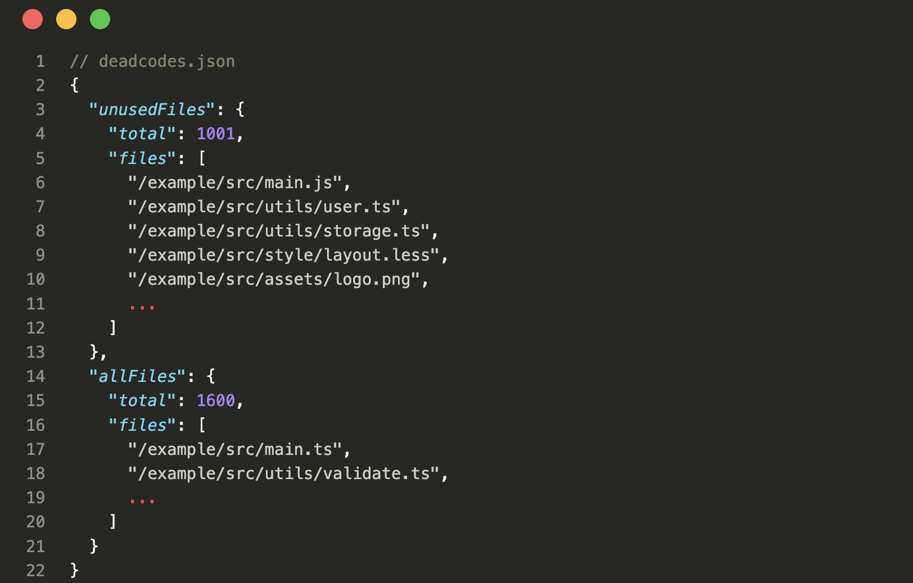

# vite-plugin-deadcodes

A vite plugin to detect unused files, which is similar to [webpack-deadcode-plugin](https://www.npmjs.com/package/webpack-deadcode-plugin).

The detected result be like:



## Supported File Types

Javascript, typescript, react, vue projects are supported:

- ✅ javascript (.js)
- ✅ typescript (.ts)
- ✅ react jsx (.jsx|.tsx)
- ✅ vue SFC or jsx|tsx files (.vue|.jsx|.tsx)
- ✅ stylesheet (.css|.less|.scss|...)
- ✅ assets (.svg|.img|.png|.mp4|...)
- ✅ ...
- ❌ Typescript files which are composed of `types only` ([see below](#type-only-files))
- ❌ Stylesheet files which are imported by `@import` statements ([see below](#stylesheet-by-import-statement))

## Installation

```bash
# npm
npm install vite-plugin-deadcodes --save-dev

# yarn
yarn add -D vite-plugin-deadcodes

# pnpm
pnpm add -D vite-plugin-deadcodes
```

## Usage

### Step 1: config plugin

```js
// vite.config.js
import { defineConfig } from 'vite';
import vitePluginDeadcodes from 'vite-plugin-deadcodes';

export default defineConfig({
  plugins: [
    vitePluginDeadcodes(),
  ]
});
```

Or use with options:

```js
// vite.config.js
import { defineConfig } from 'vite';
import vitePluginDeadcodes from 'vite-plugin-deadcodes';

export default defineConfig({
  plugins: [
    vitePluginDeadcodes({
      src: '/path/to/src',
      emit: '/path/to/result/deadcodes.json',
      excludes: ['**/*.d.ts', '**/*.(stories|spec).(js|jsx)'],
    }),
  ]
});
```

### Step 2: run build command

This plugin will only run in build mode.

```bash
npx vite build
```

## Options

```ts
interface Options {
    src?: string;
    emit?: boolean | string;
    excludes?: string[];
    console?: boolean;
}
```

### options.src (default: `path.join(process.cwd(), 'src')`)

The source dir you want to detect.

### options.emit (default: `path.join(process.cwd(), 'deadcodes.json')`)

The path of the result file.

```js
vitePluginDeadcodes({
  emit: `/path/to/result/deadcodes.json`
})
```

### options.excludes (default: `[]`)

The files that should be ignored.

vitePluginDeadcodes({
  excludes: ['**/*.d.ts', '**/*.(stories|spec).(js|jsx)'],
})


### options.console (default: `false`)

Set `true` to show result in the console.

## Addition

### Type only files

Typescript files that were composed of types only, these files will be removed by typescript parser. Example:

```ts
export type Foo = 'a' | 'b';

export interface Bar {
  name: string;
}
```

If this file contains some exports that are not type, then it can be detected. Like:

```ts
export type Foo = 'a' | 'b';

export interface Bar {
  name: string;
}

// This function will not be removed by ts parser
export const add = (a: number, b: number): number => a + b;
```

### Stylesheet By Import Statement

In the example below, styles/bar.less can not be detected, which is imported by @import statement.

Planing to fix it in the next version.

```less
// foo.less
@import '../styles/bar.less'

.name {
  color: blue;
}
```

```js
// demo.js
import './foo.less'
```
